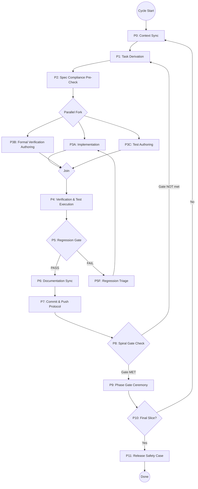

# Holly Grace — Development Procedure Graph v1.1

**Generated:** 17 February 2026
**Revised:** 17 February 2026
**Purpose:** Top-level executable procedure governing all Holly Grace development. This is the meta-process: every development cycle (human or AI agent) executes this graph. The graph is iterative — it loops per task batch within a slice, and per slice across the 15-slice spiral.

---

## 0  Genealogy Preamble — How This Procedure Came to Exist

This execution loop (P0–P11) is not the starting point. It is Phase δ in a five-phase derivation chain. The full lineage is documented in [`docs/architecture/Artifact_Genealogy.md`](architecture/Artifact_Genealogy.md); what follows is the causal summary.

### Phase α — Research & Theory

The project began with a systematic literature review (62 sources spanning information theory, morphogenetic field theory, agency formalisms, multi-agent systems, and safety engineering) and parallel industry sweeps (ISO 42010/25010/15288/12207, SpaceX responsible-engineer model, OpenAI eval-driven development, Anthropic constitutional AI, failure analysis research). These inputs were synthesized into:

> **Allen, S. P. (2026).** *Informational Monism, Morphogenetic Agency, and Goal-Specification Engineering: A Unified Framework.* v2.0, 289 pp.

The monograph provides the formal foundations: channel theory microdynamics, agency rank, cognitive light cones, goal codimension, multi-agent feasibility, steering operators, infeasibility residuals, morphogenetic field dynamics, and the APS cascade. Every implementation construct in Holly traces back to a monograph definition via the [`Monograph_Glossary_Extract.md`](Monograph_Glossary_Extract.md).

### Phase β — Architecture

A custom SAD iteration tool was developed for rapid mermaid-based architecture generation and validation. Using the monograph as the specification source, this tool produced:

- **SAD v0.1.0.2** — System Architecture Document (L0–L5, 40+ components, all boundary crossings)
- **RTD v0.1.0.2** — Repository Tree Document (target file structure)
- **repo-tree.md** — Flat file listing for scaffold generation

The SAD is the single source of truth for component topology. The RTD is the single source of truth for file placement.

### Phase γ — Specifications

From the SAD and monograph, five specification documents were derived:

1. **ICD v0.1** — 49 interface contracts for every boundary crossing in the SAD
2. **Component Behavior Specs (SIL-3)** — Formal state machines for Kernel, Sandbox, Egress
3. **Goal Hierarchy Formal Spec** — Executable predicate definitions for L0–L6
4. **SIL Classification Matrix** — Criticality assignments for every component
5. **Dev Environment Spec** — Toolchain, CI pipeline, and infrastructure requirements

Each specification inherits its authority from a monograph concept and an architecture decision.

### Phase δ — Process & Governance

From the specifications, research outputs, and the audit methodology (END_TO_END_AUDIT_CHECKLIST), four governance documents were derived:

1. **Design Methodology v1.0** — 14-step meta procedure (ISO + SpaceX + OpenAI + Anthropic synthesis)
2. **Task Manifest** — 583 tasks across 15 spiral slices, derived by applying the meta procedure to the SAD
3. **Test Governance Spec** — 65-control library, falsification-first protocol, maturity gates
4. **This document** — Development Procedure Graph, the executable loop

### Phase ε — Execution

Phase ε is the loop defined below. It consumes everything produced in α–δ and produces code, tests, evidence, and audit artifacts. When the loop completes all 15 slices, it produces a release safety case.

**Key invariant:** No artifact in this codebase exists without a derivation chain traceable through these five phases back to a monograph concept or a research finding. The Artifact Genealogy mega graph enforces this structurally.

---

## 1  Procedure Overview



---

## 2  Phase Definitions

### P0: Context Sync

**Purpose:** Establish ground truth of current system state before any work begins.

**Inputs:** Both repos (GitHub `master`, GitLab `main`), local working tree, CI pipeline state.

**Procedure:**

```
P0.1  git pull --rebase from both remotes
P0.2  git log --oneline -20 → parse last 20 commits for:
        - Slice/Phase/Step markers in commit messages
        - Co-author tags (human vs. AI agent)
        - Files touched → derive "hot zone" set
P0.3  git diff HEAD~5..HEAD → identify recent delta surface
P0.4  Read CI pipeline status (last run: pass/fail, coverage delta, lint status)
P0.5  Load current slice state:
        - Parse Task_Manifest.md → identify current slice number
        - Enumerate tasks with status {pending, in_progress, completed, blocked}
        - Identify critical path tasks (from manifest's critical path annotations)
P0.6  Load architecture state:
        - Parse SAD_0.1.0.2.mermaid → current component inventory
        - Parse RTD_0.1.0.2.mermaid → current file tree
        - Diff against actual repo tree → detect drift
P0.7  Load spec state:
        - ICD_v0.1.md → interface inventory (49 interfaces)
        - SIL_Classification_Matrix.md → component SIL assignments
        - Component_Behavior_Specs_SIL3.md → formal state machines
        - Goal_Hierarchy_Formal_Spec.md → goal predicates
        - Monograph_Glossary_Extract.md → theory-to-implementation mapping
        - Test_Governance_Spec.md → control library, maturity profile, artifact checklists
        - docs/audit/trace_matrix.csv → current trace chain state (if exists)
        - docs/audit/finding_register.csv → open findings (if exists)
P0.8  Determine current maturity profile:
        Slices 1–5 → Early | Slices 6–10 → Operational | Slices 11–15 → Hardened
P0.9  Emit context digest: {slice, phase, step, pending_tasks[], blocked_tasks[],
        critical_path_next, ci_status, coverage_pct, drift_warnings[]}
```

**Output:** Context Digest object consumed by all subsequent phases.

**Exit Criterion:** Context Digest populated with zero unresolved drift warnings, or drift warnings explicitly triaged.

---

### P1: Task Derivation

**Purpose:** Select the next batch of tasks to execute from the Task Manifest, respecting dependencies, SIL ordering, and critical path.

**Inputs:** Context Digest from P0, Task_Manifest.md.

**Procedure:**

```
P1.1  Filter Task Manifest to current slice
P1.2  Topological sort on task dependency graph
P1.3  Identify unblocked tasks (all predecessors completed)
P1.4  Priority ordering within unblocked set:
        (a) Critical path tasks first
        (b) SIL-3 before SIL-2 before SIL-1 (higher SIL = earlier)
        (c) Within same SIL: prefer tasks with more downstream dependents
P1.5  Batch selection:
        - Parallelizable tasks (no mutual dependencies) → batch together
        - Sequential chains → serialize
        - Batch size ≤ 5 tasks per cycle (cognitive load bound)
P1.6  For each selected task, extract from manifest:
        - Task ID, description, acceptance criteria
        - Referenced ICD interfaces
        - Referenced behavior specs
        - Referenced goal predicates
        - SIL level → verification method set (from SIL Classification Matrix)
P1.7  Test Governance Derivation (per Test_Governance_Spec.md §3):
  P1.7.1  Build control applicability matrix:
           For each task, walk the 65-control library (SEC/TST/ARC/OPS/CQ/GOV).
           A control is APPLICABLE when task.sil_level >= ctrl.sil_threshold
           AND ctrl.domain intersects task.affected_domains.
  P1.7.2  Derive test requirements per applicable control:
           Each requirement = {ctrl_id, claim, adversary, verification_method,
           test_type, falsification_required}
  P1.7.3  Assemble trace chain stubs:
           Monograph Concept → Requirement → Control → Test (stub) → Evidence
  P1.7.4  Select SIL-appropriate test artifact checklist (TGS §3.4)
  P1.7.5  Determine maturity gates for current slice:
           Slices 1–5:  Security Gate + Test Gate
           Slices 6–10: + Traceability Gate
           Slices 11–15: + Ops Gate

P1.8  Emit Task Batch: [{task_id, description, acceptance_criteria,
        icd_refs[], behavior_spec_refs[], goal_refs[], sil_level,
        verification_methods[], estimated_effort,
        applicable_controls[], test_requirements[], trace_stubs[],
        artifact_checklist, maturity_gates[]}]
```

**Output:** Ordered Task Batch with full test governance derivation.

**Exit Criterion:** Non-empty batch selected with test governance derivation complete, or all tasks in current slice are completed (→ skip to P8).

---

### P2: Spec Compliance Pre-Check

**Purpose:** Before writing any code, verify that the task's target components, interfaces, and contracts are fully specified. Identify gaps before they become implementation bugs.

**Inputs:** Task Batch from P1, all spec documents.

**Procedure:**

```
P2.1  For each task in batch:
  P2.1.1  Identify affected components (SAD node names)
  P2.1.2  Look up each component's SIL in SIL_Classification_Matrix.md
  P2.1.3  Look up each component's interfaces in ICD_v0.1.md
           - Verify: every interface the component participates in has a schema defined
           - Flag: any interface referenced in task but absent from ICD → SPEC GAP
  P2.1.4  For SIL-3 components: look up state machine in Component_Behavior_Specs_SIL3.md
           - Verify: all states, transitions, guards, and failure predicates defined
           - Flag: any transition implied by task but absent from spec → SPEC GAP
  P2.1.5  Look up monograph grounding in Monograph_Glossary_Extract.md
           - Verify: implementation construct maps to monograph concept
           - Flag: implementation term with no monograph grounding → THEORY GAP
  P2.1.6  For goal-related tasks: look up goal predicates in Goal_Hierarchy_Formal_Spec.md
           - Verify: all referenced predicates have formal definitions
           - Flag: predicate referenced but undefined → SPEC GAP

P2.2  Aggregate gaps:
        - If SPEC_GAP count > 0: emit gap report, halt batch, create spec tasks
        - If THEORY_GAP count > 0 and component is SIL-2+: emit gap report, halt batch
        - If THEORY_GAP count > 0 and component is SIL-1: emit warning, proceed

P2.3  Emit Pre-Check Report: {tasks_cleared[], gaps[], halt_reason?}
```

**Output:** Pre-Check Report. If gaps found, cycle returns to P1 with newly-created spec-fill tasks injected.

**Exit Criterion:** All tasks in batch pass pre-check with zero SPEC_GAPs and zero blocking THEORY_GAPs.

---

### P3A: Implementation

**Purpose:** Write production code against specs.

**Inputs:** Cleared Task Batch from P2, all spec documents.

**Procedure:**

```
P3A.1  Branch creation per Dev_Environment_Spec.md §9:
         - Feature branch: feat/slice-{N}-{task_id}-{short_description}
         - From: develop (or master if no develop branch yet)

P3A.2  For each task, implement against:
  P3A.2.1  ICD schemas → Pydantic v2 models with validators
  P3A.2.2  Behavior specs → state machine implementation matching formal spec
  P3A.2.3  Goal predicates → executable predicate functions
  P3A.2.4  Monograph constructs → implementation following glossary mapping

P3A.3  Kernel invariant compliance:
         - Every boundary crossing wrapped in KernelContext
         - K1–K8 gates invoked in correct order per Behavior Spec §1
         - No raw boundary crossing (every inter-component call goes through kernel)

P3A.4  Architecture-as-code compliance:
         - New modules placed per RTD file tree
         - Imports follow SAD layer dependency rules (no upward imports)
         - New components registered in architecture.yaml (when parser exists)

P3A.5  Code quality (enforced by pre-commit, verified here):
         - ruff format + ruff check (zero violations)
         - mypy strict (zero errors on touched files)
         - No TODO without linked task ID
         - Docstrings on all public APIs (Google style)

P3A.6  Emit: {files_created[], files_modified[], loc_delta, components_touched[]}
```

---

### P3B: Formal Verification Authoring (parallel with P3A)

**Purpose:** Write TLA+ specs and property-based test specifications for SIL-3 components.

**Inputs:** Cleared Task Batch (SIL-3 tasks only), Component_Behavior_Specs_SIL3.md.

**Procedure:**

```
P3B.1  For each SIL-3 component in batch:
  P3B.1.1  Write/update TLA+ specification matching behavior spec state machine
  P3B.1.2  Define invariants: safety properties (always true), liveness (eventually true)
  P3B.1.3  Define temporal properties for deadlock freedom
  P3B.1.4  Configure TLC model checker parameters (state space bounds)

P3B.2  For SIL-2 components: write Hypothesis strategy definitions
         - Custom strategies for domain types (GoalLevel, AgentConfig, TenantId)
         - Shrinking strategies for minimal counterexample discovery

P3B.3  Emit: {tla_specs[], hypothesis_strategies[], invariants_defined}
```

**Applicability:** Only executes if batch contains SIL-3 or SIL-2 tasks. Skipped for SIL-1-only batches.

---

### P3C: Test Authoring (parallel with P3A)

**Purpose:** Write all test levels required by the task's SIL classification AND its test governance obligations from P1.7.

**Inputs:** Cleared Task Batch with test governance derivation (P1.7/P1.8), SIL_Classification_Matrix.md, Test_Governance_Spec.md.

**Procedure:**

```
P3C.0  Load test governance derivation from P1.7 for each task:
         - applicable_controls[] — which controls this task must satisfy
         - test_requirements[] — specific test requirements per control
         - trace_stubs[] — trace chain stubs to be completed
         - artifact_checklist — SIL-appropriate checklist from TGS §3.4

P3C.1  For each task, author tests per BOTH SIL level AND applicable controls:

  SIL-3 requires ALL of:
    P3C.1.1  TLA+ invariant checks (authored in P3B)
    P3C.1.2  Property-based tests (Hypothesis) — minimum 3 properties per component
    P3C.1.3  Unit tests (pytest) — minimum 95% branch coverage on touched code
    P3C.1.4  Integration tests — every ICD interface exercised
    P3C.1.5  Adversarial tests — ≥1 per FMEA failure mode + known attack vectors
    P3C.1.6  Dissimilar verification test (independent code path)
    P3C.1.7  Falsification ratio: negative tests ≥ positive tests
    P3C.1.8  Concurrency tests for shared-state components
    P3C.1.9  Boundary tests for all bounded resources at/beyond limits

  SIL-2 requires:
    P3C.1.2 through P3C.1.5 (property-based, unit, integration, adversarial)
    P3C.1.10 FMEA-driven tests — one test per identified failure mode
    P3C.1.11 Falsification: negative tests ≥ 50% of positive test paths
    P3C.1.8  Concurrency tests if component has shared state
    P3C.1.9  Boundary tests for bounded resources

  SIL-1 requires:
    P3C.1.3 through P3C.1.4 (unit, integration)
    P3C.1.12 Regression test: fails on old behavior, passes on new

P3C.2  Control-driven test authoring (per Test_Governance_Spec.md §3.2):
         For each applicable control in test_requirements[]:
           - Write test that FALSIFIES the control's claim (adversary test)
           - Write test that CONFIRMS the control holds (positive test)
           - Naming: test_{component}_{ctrl_id}_{adversary}_{expected}
           - Each test function docstring cites: ctrl_id, claim, adversary

P3C.3  Trace chain completion:
         For each trace_stub from P1.7.3:
           - Fill in test file:function reference
           - Verify chain: Monograph Concept → Requirement → Control → Test → Evidence
           - Write trace_matrix_entry row

P3C.4  Agentic-specific tests (if task touches agents/LLM/MCP/sandbox):
         Per Test_Governance_Spec.md §4.1:
           - WebSocket origin bypass (if WS involved)
           - Plugin endpoint unauthenticated access (if MCP involved)
           - Outbound payload secret redaction (if egress involved)
           - Capability manifest boundary violation (if permissions involved)
           - Prompt injection detection (if agent involved)
           - Loop detection (if workflow involved)

P3C.5  Test location per RTD: tests/unit/, tests/integration/, tests/property/, tests/adversarial/
P3C.6  Artifact checklist verification:
         Walk the SIL-appropriate checklist from TGS §3.4.
         Every checkbox must be satisfied before P3C emits.
         Unsatisfied checkboxes → specific gap listed in emit.

P3C.7  Emit: {test_files[], test_count_by_type, coverage_target_pct,
         trace_matrix_entries[], control_coverage: {covered, total},
         falsification_ratio, artifact_checklist_status: COMPLETE/GAPS,
         gaps[] (if any)}
```

---

### P4: Verification & Test Execution

**Purpose:** Execute all verification artifacts. This is the quality gate before regression.

**Inputs:** Implementation from P3A, specs from P3B, tests from P3C.

**Procedure:**

```
P4.1  Static analysis pipeline (10-stage CI from Dev_Environment_Spec.md §7):
  P4.1.1  ruff check --fix=false (lint)
  P4.1.2  ruff format --check (formatting)
  P4.1.3  mypy --strict (type checking)
  P4.1.4  bandit -r holly/ (security lint)
  P4.1.5  Architecture-as-code gate (import DAG validation, when available)

P4.2  TLA+ model checking (SIL-3 only):
  P4.2.1  Run TLC on all .tla specs in batch
  P4.2.2  Zero violations required
  P4.2.3  Record state space explored, time elapsed

P4.3  Test execution:
  P4.3.1  pytest tests/unit/ -k {batch_filter} --cov --cov-branch
  P4.3.2  pytest tests/property/ -k {batch_filter} (Hypothesis)
  P4.3.3  pytest tests/integration/ -k {batch_filter}
  P4.3.4  pytest tests/adversarial/ -k {batch_filter} (SIL-3 only)

P4.4  Coverage analysis:
  P4.4.1  Branch coverage on touched files ≥ threshold:
           - SIL-3: ≥ 95%
           - SIL-2: ≥ 85%
           - SIL-1: ≥ 70%
  P4.4.2  Coverage delta: no file drops more than 2% from prior commit

P4.5  Acceptance criteria verification:
  P4.5.1  For each task: evaluate acceptance criteria from manifest
  P4.5.2  Each criterion must be demonstrably met (test passes, metric achieved)
  P4.5.3  Record evidence: {criterion, evidence_type, evidence_location}

P4.6  Test Governance Compliance Check (per Test_Governance_Spec.md §8, P4.5a):
  P4.6.1  Control coverage: every applicable control has ≥1 test
  P4.6.2  Falsification ratio meets SIL threshold:
           - SIL-3: negative tests ≥ positive tests
           - SIL-2: negative tests ≥ 50% of positive tests
  P4.6.3  Trace chain complete: every test → control → requirement →
           (monograph concept if SIL-2+)
  P4.6.4  No orphan tests (tests not linked to any control)
  P4.6.5  No orphan controls (applicable controls without tests)
  P4.6.6  Artifact checklist fully satisfied (from P3C.6)
  P4.6.7  Agentic test categories present (if task touches agents)

P4.7  Emit Verification Report:
        {static_analysis: PASS/FAIL, tlc_result: PASS/FAIL/NA,
         tests: {unit: n/n, property: n/n, integration: n/n, adversarial: n/n},
         coverage: {touched_files_pct, delta_pct},
         acceptance: [{criterion, met: bool, evidence}],
         test_governance: {control_coverage: n/n, falsification_ratio: float,
           trace_completeness: n/n, orphan_tests: n, orphan_controls: n,
           artifact_checklist: PASS/FAIL, agentic_coverage: PASS/FAIL/NA}}

P4.8  Gate: ALL must be true to proceed:
        - static_analysis == PASS
        - tlc_result ∈ {PASS, NA}
        - all test suites: 0 failures
        - coverage thresholds met
        - all acceptance criteria met
        - test_governance.control_coverage == n/n (100%)
        - test_governance.falsification_ratio meets SIL threshold
        - test_governance.orphan_tests == 0
        - test_governance.orphan_controls == 0
        - test_governance.artifact_checklist == PASS
       If ANY fails → cycle back to P3A/P3C with specific gaps identified
```

---

### P5: Regression Gate

**Purpose:** Verify that new changes do not break existing functionality. This runs the FULL test suite, not just batch-scoped tests.

**Inputs:** Verification Report from P4 (batch passed), full codebase.

**Procedure:**

```
P5.1  Run full test suite: pytest tests/ --cov --cov-branch -x (fail-fast)
P5.2  Compare coverage to baseline:
        - Load coverage from last passing commit on develop/master
        - Δ coverage must be ≥ 0 (no regression)
        - Per-file: no file drops > 2%
P5.3  SIL boundary crossing validation:
        - Scan all inter-component calls
        - Verify every crossing passes through KernelContext
        - Verify SIL inheritance on boundaries (higher SIL wins)
P5.4  Interface contract regression:
        - Run ICD schema validation on all existing interfaces
        - Verify no schema has been narrowed (breaking change)
        - New fields must be optional (additive-only change)
P5.5  Architecture drift check:
        - Compare import graph against SAD layer rules
        - No upward imports (L3 cannot import L2, L2 cannot import L1)
        - Flag any new cross-layer dependency not in SAD
P5.6  Emit Regression Report:
        {full_suite: PASS/FAIL, coverage_delta, boundary_violations[],
         schema_regressions[], architecture_drift[]}
```

**Gate:** All fields PASS and all violation arrays empty. On FAIL → P5F.

---

### P5F: Regression Triage

**Purpose:** Diagnose and fix regressions without losing forward progress.

**Procedure:**

```
P5F.1  Classify each failure:
         - SELF_CAUSED: new code broke new test → fix in P3A
         - REGRESSION: new code broke existing test → fix in P3A, root cause required
         - FLAKY: test passes on retry → mark as flaky, file tech debt task
         - ENVIRONMENT: CI environment issue → retry, document if persistent
P5F.2  For REGRESSION failures:
         - git bisect to identify breaking commit (within current batch)
         - Root cause analysis: which spec was violated?
         - Fix must restore prior behavior AND preserve new functionality
P5F.3  Loop back to P3A with regression fix tasks prepended to batch
```

---

### P6: Documentation Sync

**Purpose:** Keep all documentation synchronized with implementation state.

**Inputs:** Completed batch (all tests pass, regression clear).

**Procedure:**

```
P6.1  Task Manifest update:
        - Mark completed tasks as DONE with date and commit SHA
        - Update task status counts in summary table
        - If new tasks discovered during implementation → append to manifest

P6.2  Architecture sync (if architecture changed):
  P6.2.1  Update SAD mermaid if new components added or edges changed
  P6.2.2  Update RTD mermaid if new files/directories created
  P6.2.3  Increment SAD/RTD version number (semver patch)

P6.3  ICD update (if interfaces changed):
  P6.3.1  New interface → add to ICD with full schema
  P6.3.2  Modified interface → update schema, bump version, note in changelog
  P6.3.3  Verify ICD count matches actual interface count

P6.4  ADR creation (if architectural decision was made):
  P6.4.1  Create ADR per Dev_Environment_Spec.md §10 template
  P6.4.2  Record: context, decision, consequences, alternatives rejected
  P6.4.3  File: docs/adr/ADR-{NNN}-{short-title}.md

P6.5  Designer's Diary Entry (per README convention):
  P6.5.1  If slice boundary crossed or significant design insight → new diary entry
  P6.5.2  Append to README.md Designer's Diary section

P6.6  Emit: {docs_updated[], adr_created?, diary_entry?}
```

---

### P7: Commit & Push Protocol

**Purpose:** Atomic commit to both repositories with traceable commit messages.

**Inputs:** All code and doc changes from P3–P6.

**Procedure:**

```
P7.1  Stage files:
        - git add specific files (never git add -A)
        - Exclude: .env, credentials, __pycache__, .mypy_cache

P7.2  Commit message format:
        {type}(slice-{N}/step-{S}): {description}

        {body: what changed and why}

        Tasks: {task_ids}
        SIL: {max_sil_in_batch}
        Gate: {gate_status}
        Coverage: {coverage_pct}

        Co-Authored-By: Claude Opus 4.6 <noreply@anthropic.com>

        Types: feat, fix, test, spec, docs, refactor, ci

P7.3  Push to GitHub (master):
        git push origin master

P7.4  Push to GitLab (main) via API:
        POST /api/v4/projects/341/repository/commits
        with base64-encoded file contents

P7.5  Verify both pushes succeeded:
        - GitHub: verify commit SHA appears in remote log
        - GitLab: verify API response contains commit ID

P7.6  Emit: {github_sha, gitlab_sha, files_committed[], commit_message}
```

---

### P8: Spiral Gate Check

**Purpose:** Determine whether the current slice's phase gate criteria are met.

**Inputs:** Context Digest (updated), Task Manifest (updated), Gate criteria from manifest summary table.

**Procedure:**

```
P8.1  Load gate criteria for current slice from Task Manifest summary:
        Slice 1  → "Spiral gate: enforcement loop e2e"
        Slice 2  → "Phase A: arch enforcement complete"
        Slice 3  → "Phase B: kernel verified SIL-3"
        Slice 4  → "Phase C: storage tested"
        Slice 5  → "Phase D: safety case for infra"
        Slice 6  → "Phase E: core integration tested"
        Slice 7  → "Phase F: engine e2e tested"
        Slice 8  → "Phase G: sandbox SIL-3 pass"
        Slice 9  → "Phase H: API + auth tested"
        Slice 10 → "Phase I: observability live"
        Slice 11 → "Phase J: agents + constitution exec"
        Slice 12 → "Phase K: eval pipeline gates merges"
        Slice 13 → "Phase L: config operational"
        Slice 14 → "Phase M: console functional"
        Slice 15 → "Phase N: release safety case"

P8.2  Evaluate gate:
  P8.2.1  All tasks in slice marked DONE?
  P8.2.2  Gate-specific criteria met? (e.g., "kernel verified SIL-3" requires
           TLC zero violations on all kernel TLA+ specs)
  P8.2.3  No open SPEC_GAPs or THEORY_GAPs for this slice?
  P8.2.4  Coverage baseline meets slice's SIL floor?
  P8.2.5  CI pipeline green on develop/master?
  P8.2.6  Maturity gate evaluation (per Test_Governance_Spec.md §5):
           Slices 1–5 (Early):
             - Security Gate: zero Critical/High findings, SEC-001–015 satisfied
             - Test Gate: TST-001 zero failures, TST-002 coverage thresholds,
               TST-009/010 no creds/live calls
           Slices 6–10 (Operational): above PLUS:
             - Traceability Gate: zero orphan Tier 1 controls/requirements,
               Tier 1 trace coverage ≥ 90%
           Slices 11–15 (Hardened): above PLUS:
             - Ops Gate: OPS-001 health endpoint, OPS-004 rollback tested,
               OPS-005 CI pipeline stages, OPS-008 runbook-linked alerts
  P8.2.7  Test governance self-test (per Test_Governance_Spec.md §9):
           ST-01 through ST-10 all pass for every task in this slice

P8.3  If gate NOT met → loop to P1 (continue tasks in current slice)
       If gate MET → proceed to P9
```

---

### P9: Phase Gate Ceremony

**Purpose:** Formal acknowledgment of phase completion. Creates audit record and updates project state.

**Procedure:**

```
P9.1  Generate Phase Gate Report:
        - Slice number, phase letter, date
        - Tasks completed (count, list)
        - Verification evidence summary (TLC results, test counts, coverage)
        - Gate criteria evaluation (each criterion + evidence)
        - Open risks / tech debt carried forward
        - Person-weeks expended vs. estimated

P9.2  Update Task Manifest:
        - Slice status → COMPLETED
        - Record gate passage date and commit SHA

P9.3  Tag release:
        - git tag v0.{slice}.0 -m "Phase {letter} gate passed"
        - Push tag to both remotes

P9.4  Designer's Diary Entry:
        - Record phase completion, key learnings, risks

P9.5  Advance slice counter → proceed to P0 for next slice
```

---

### P10/P11: Final Slice & Release Safety Case

**Purpose:** Slice 15 (Phase N) culminates in the release safety case.

**Procedure:**

```
P10  Check: current_slice == 15 AND P8 gate met?
       No  → P0 (next slice)
       Yes → P11

P11  Release Safety Case (Phase N, steps 79–86):
  P11.1  Aggregate all phase gate reports
  P11.2  Verify 583/583 tasks DONE
  P11.3  Final behavior spec validation (task 84.7)
  P11.4  Goal hierarchy theorem verification (task 84.8)
  P11.5  Full TLC run on all TLA+ specs (zero violations)
  P11.6  Full test suite (zero failures, coverage ≥ thresholds)
  P11.7  Penetration testing (adversarial + escape tests)
  P11.8  Safety case document assembly
  P11.9  Executive sign-off on residual risk register
  P11.10 Tag v1.0.0, push to both remotes
```

---

## 3  Invariants (must hold at ALL times during execution)

These invariants are checked continuously, not just at gates:

| ID | Invariant | Verification |
|----|-----------|--------------|
| **I1** | No code merged without passing P4 verification | CI pipeline enforces; pre-commit hooks |
| **I2** | SIL classification is monotonic within a component (SIL can increase, never decrease) | P2 pre-check validates |
| **I3** | ICD schemas are additive-only (new optional fields allowed; removal/narrowing forbidden) | P5.4 regression check |
| **I4** | Every inter-component call passes through KernelContext | P5.3 boundary scan; architecture-as-code gate |
| **I5** | Coverage never decreases on existing files | P5.2 baseline comparison |
| **I6** | Both repos (GitHub, GitLab) have identical content at every commit | P7.5 dual-push verification |
| **I7** | Every implementation construct traces to a monograph concept (SIL-2+) | P2.1.5 theory gap check |
| **I8** | Task Manifest is the single source of truth for work items | P6.1 sync; no work done outside manifest |
| **I9** | SAD/RTD match actual repo structure | P0.6 drift detection; P6.2 sync |
| **I10** | Lexicographic goal ordering is never violated in code | K8 eval gate; P4.5 acceptance check |
| **I11** | Every test traces to a control, every control traces to a requirement | P4.6 test governance compliance check |
| **I12** | Falsification-first: no SIL-2+ task completes without negative tests | P4.6.2 falsification ratio check |
| **I13** | No applicable control left untested at gate passage | P8.2.6 maturity gate; P4.6.1 coverage |

---

## 4  Cycle Timing Expectations

| Cycle Scope | Typical Duration | Tasks per Cycle |
|-------------|-----------------|-----------------|
| Single task (SIL-1) | 1–2 hours | 1 |
| Task batch (SIL-2) | 2–4 hours | 3–5 |
| Task batch (SIL-3) | 4–8 hours | 1–3 |
| Slice completion | 1–3 weeks | 14–86 tasks |
| Full project (15 slices) | ~6 months | 583 tasks |

---

## 5  Error Recovery Protocols

### 5.1  Spec Gap Discovered (P2 halt)

```
1. Create spec-fill task(s) in Task Manifest
2. Execute spec-fill tasks (mini P3→P4 cycle, docs-only)
3. Re-enter P2 with original batch
```

### 5.2  Verification Failure (P4 gate fail)

```
1. Identify failing component and test
2. Root cause: implementation error vs. spec ambiguity vs. test error
3. Fix at source (code, spec, or test)
4. Re-execute P4 (do not skip any checks)
```

### 5.3  Regression (P5 fail)

```
1. Enter P5F triage
2. Classify: SELF_CAUSED | REGRESSION | FLAKY | ENVIRONMENT
3. Fix regression (preserve both old and new behavior)
4. Re-execute P5 from scratch
```

### 5.4  Dual-Push Divergence (P7 fail)

```
1. Identify which repo failed
2. Retry push to failed repo
3. If persistent: manual reconciliation via API
4. Verify SHA match across both repos before proceeding
```

### 5.5  Gate Criteria Ambiguity (P8)

```
1. Review gate criteria text in Task Manifest
2. If ambiguous: create ADR documenting interpretation
3. Apply interpretation consistently for remainder of project
```

---

## 6  Cross-Reference: Procedure ↔ Documentation Suite

| Procedure Phase | Primary Documents Consumed | Documents Updated |
|----------------|---------------------------|-------------------|
| P0 Context Sync | All docs (read-only) | — |
| P1 Task Derivation | Task_Manifest.md, SIL_Classification_Matrix.md, **Test_Governance_Spec.md §2–3** | — |
| P2 Spec Pre-Check | ICD_v0.1.md, Component_Behavior_Specs_SIL3.md, Goal_Hierarchy_Formal_Spec.md, Monograph_Glossary_Extract.md | — (or creates spec-fill tasks) |
| P3A Implementation | ICD, Behavior Specs, Goal Hierarchy, Monograph Glossary, Dev_Environment_Spec.md | — |
| P3B Formal Verification | Component_Behavior_Specs_SIL3.md | TLA+ specs (new files) |
| P3C Test Authoring | SIL_Classification_Matrix.md, **Test_Governance_Spec.md §3–4** | Test files, **trace_matrix_entries**, **artifact_checklist** |
| P4 Verification | Dev_Environment_Spec.md §7, **Test_Governance_Spec.md §8** | — |
| P5 Regression | SIL_Classification_Matrix.md (boundary rules), ICD (schemas) | — |
| P6 Doc Sync | Task_Manifest.md, SAD, RTD, ICD | Task_Manifest.md, SAD, RTD, ICD, ADRs, README, **trace_matrix.csv** |
| P7 Commit | Dev_Environment_Spec.md §9 (branch strategy) | — |
| P8 Gate Check | Task_Manifest.md, **Test_Governance_Spec.md §5 (maturity gates)** | **gate_assessment.csv, kpi_snapshot.csv** |
| P9 Ceremony | All docs | Task_Manifest.md, README, git tags |

---

## 7  Execution Modes

This procedure supports three execution modes:

| Mode | Executor | P3A–P3C Parallelism | HITL Gates | Typical Batch Size |
|------|----------|---------------------|------------|-------------------|
| **AI Agent** | Claude (via Cowork/Code) | Sequential (single context) | Async notification to human | 1–3 tasks |
| **Human Developer** | Engineer | True parallel (IDE + TLA+ Toolbox) | Synchronous self-review | 3–5 tasks |
| **Pair** | Human + AI Agent | AI writes P3A/P3C, Human writes P3B, joint P4 | Real-time | 2–4 tasks |

All modes execute the same graph. The procedure is executor-agnostic.

---

*This document is the top-level operating procedure for Holly Grace development. All other documents (Task Manifest, SIL Matrix, Dev Env Spec, ICD, Behavior Specs, Goal Hierarchy, Monograph Glossary) are consumed by this procedure. No development work occurs outside this graph.*
