# Holly Grace — Artifact Genealogy & Derivation Graph

**Generated:** 17 February 2026
**Purpose:** Complete lineage of every artifact in the Holly Grace codebase. This document traces how the project was actually built — from first literature review through to the execution loop that produces code. Nothing in the repo exists without a derivation chain back to a source.

---

## 1  The Mega Graph

Every node is an artifact that exists (or existed as a research phase). Every edge is a derivation relationship: the target was produced *from* the source. Color coding: red = external research, blue = theory/monograph, green = architecture, orange = specifications, purple = process/governance, gray = execution outputs.

```mermaid
graph TD
    %% ═══════════════════════════════════════════
    %% PHASE α: RESEARCH & THEORY
    %% ═══════════════════════════════════════════

    subgraph ALPHA["Phase α - Research and Theory"]
        direction TB
        LIT["Literature Review\n62 sources: Landauer, Bennett,\nZurek, Baez, Friston, Anthropic"]
        ISO["ISO Sweep\n42010, 25010,\n15288, 12207"]
        SPX["SpaceX Model\nresponsible-engineer,\nSIL stratification"]
        OAI["OpenAI Methodology\neval-driven dev,\nstaged rollouts"]
        ANTH["Anthropic Safety\nconstitutional AI,\ndefense-in-depth"]
        FAIL["Failure Research\n41-87% multi-agent failure,\nFMEA/FTA"]
        FIT["Fitness Functions\nResearch"]
        MONO["Monograph v2.0\n289 pp, Allen 2026\nInformational Monism,\nMorphogenetic Agency,\nGoal-Spec Engineering"]
        DM["Design Methodology\nv1.0 docx"]

        LIT --> MONO
    end

    style ALPHA fill:#fef2f2,stroke:#dc2626

    %% ═══════════════════════════════════════════
    %% PHASE β: ARCHITECTURE
    %% ═══════════════════════════════════════════

    subgraph BETA["Phase β - Architecture"]
        direction TB
        SADTOOL["Custom SAD Iteration Tool\nrapid mermaid generation\n+ validation pipeline"]
        SAD["SAD v0.1.0.5\nSystem Architecture Document\nMermaid flowchart:\nL0-L5, 48 components"]
        RTD["RTD v0.1.0.4\nRepository Tree Document\nMermaid tree:\ndeploy/, holly/, console/,\ntests/, docs/"]
        REPOTREE["repo-tree.md\nFlat file listing"]
    end

    style BETA fill:#eff6ff,stroke:#2563eb

    %% ═══════════════════════════════════════════
    %% PHASE γ: SPECIFICATIONS
    %% ═══════════════════════════════════════════

    subgraph GAMMA["Phase γ - Specifications"]
        direction TB
        ICD["ICD v0.1\n49 interface contracts\nSchema, error, latency,\nbackpressure, redaction"]
        CBS["Component Behavior Specs\nSIL-3 state machines\nKernel, Sandbox, Egress"]
        GHS["Goal Hierarchy\nFormal Spec\n7-level hierarchy,\nL0-L6 predicates,\n3 theorems"]
        SIL["SIL Classification\nMatrix v1.0\n47 components,\nSIL-1/2/3"]
        DEV["Dev Environment\nSpec v1.0\ntoolchain, CI,\nbranch strategy"]
        MGE["Monograph Glossary\nExtract\n104 symbols,\ntheory-impl mapping"]
    end

    style GAMMA fill:#f0fdf4,stroke:#16a34a

    %% ═══════════════════════════════════════════
    %% PHASE δ: PROCESS & GOVERNANCE
    %% ═══════════════════════════════════════════

    subgraph DELTA["Phase δ - Process and Governance"]
        direction TB
        README["README.md\nMeta Procedure 14-step,\nTask Derivation Protocol,\nDesigners Diary"]
        TM["Task Manifest v2\n583 tasks, 15 slices,\n86 roadmap steps"]
        DPG["Development Procedure\nGraph v1.1\nP0-P11 execution loop"]
        TGS["Test Governance\nSpec v1.0\n62 controls, falsification-first,\nmaturity gates"]
        AUDIT["END_TO_END_AUDIT\nCHECKLIST\n12-stage, P0-P11,\n4 release gates"]
    end

    style DELTA fill:#fdf4ff,stroke:#9333ea

    %% ═══════════════════════════════════════════
    %% PHASE ε: EXECUTION OUTPUTS (future)
    %% ═══════════════════════════════════════════

    subgraph EPSILON["Phase ε - Execution Outputs Slice 1+"]
        direction TB
        SADPARSE["SAD Parser\nsad_parser.py\nmermaid -> AST"]
        SCHEMA["Architecture Schema\nschema.py\nPydantic models"]
        EXTRACT["Extraction Pipeline\nextract.py\nSAD -> YAML"]
        MPARSE["Manifest Parser\nmanifest_parser.py\nTask Manifest -> Manifest"]
        TRACK["Status Tracker\ntracker.py\nGantt + PROGRESS.md"]
        DEPS["Dependency Graph\ndependencies.py\nDAG + duration model"]
        GVALID["Gantt Validator\ngantt_validator.py\nmermaid rendering checks"]
        REG["Architecture Registry\nregistry.py\nsingleton loader"]
        DEC["Decorators\ndecorators.py\n5 arch decorators"]
        CLI["CLI Module\ncli.py\ncommand-line entry"]
        AYML["architecture.yaml"]
        GANTT["GANTT.mermaid\nGANTT_critical.mermaid"]
        PROG["PROGRESS.md"]
        STATYS["status.yaml"]
        TESTS["Test Suite\n276 tests across\n14 test modules"]
        CODE["holly/ source tree"]
    end

    style EPSILON fill:#f9fafb,stroke:#6b7280

    %% ═══════════════════════════════════════════
    %% DERIVATION EDGES
    %% ═══════════════════════════════════════════

    %% Phase α internal
    ISO --> DM
    SPX --> DM
    OAI --> DM
    ANTH --> DM
    FAIL --> DM
    FIT --> DM

    %% Phase α → β (Theory → Architecture)
    MONO --> SAD
    MONO --> MGE
    DM --> SADTOOL
    SADTOOL --> SAD
    SAD --> RTD
    SAD --> REPOTREE

    %% Phase α → γ (Research → Specs)
    MONO --> GHS
    MONO --> CBS
    SPX --> SIL
    FAIL --> SIL
    ISO --> DEV
    OAI --> DEV
    ANTH --> CBS

    %% Phase β → γ (Architecture → Specs)
    SAD --> ICD
    SAD --> SIL
    SAD --> CBS
    SAD --> DEV
    RTD --> DEV

    %% Phase α+β → δ (Theory+Architecture → Process)
    MONO --> README
    DM --> README
    SAD --> README
    ISO --> README
    SPX --> README
    OAI --> README
    ANTH --> README

    %% Phase γ → δ (Specs → Process)
    README --> TM
    ICD --> TM
    CBS --> TM
    GHS --> TM
    SIL --> TM
    SAD --> TM

    %% Task Manifest validation loop
    TM -->|"validated against"| ICD
    TM -->|"validated against"| CBS
    TM -->|"validated against"| GHS

    %% Procedure Graph derivation
    TM --> DPG
    SIL --> DPG
    DEV --> DPG
    ICD --> DPG
    CBS --> DPG
    GHS --> DPG
    MGE --> DPG

    %% Test Governance derivation
    AUDIT --> TGS
    SIL --> TGS
    DPG --> TGS
    MONO --> TGS

    %% TGS feeds back into DPG
    TGS --> DPG

    %% Phase δ → ε (Process → Execution)
    DPG --> SADPARSE
    DPG --> MPARSE
    DPG --> TRACK
    DPG --> TESTS
    DPG --> CODE

    %% Specs → Execution (architecture)
    SAD --> SADPARSE
    SAD --> SCHEMA
    SAD --> EXTRACT
    SAD --> AYML
    ICD --> CODE
    CBS --> CODE
    GHS --> CODE
    SIL --> TESTS
    DEV --> CODE
    MGE --> CODE
    TGS --> TESTS

    %% Task Manifest → Execution (tracking)
    TM --> MPARSE
    TM --> TRACK
    TM --> DEPS

    %% Execution internal derivations
    SADPARSE --> SCHEMA
    SCHEMA --> EXTRACT
    EXTRACT --> AYML
    MPARSE --> TRACK
    MPARSE --> DEPS
    DEPS --> TRACK
    DEPS --> GANTT
    TRACK --> GANTT
    TRACK --> PROG
    GVALID --> TRACK
    STATYS --> TRACK
    STATYS --> PROG
    CLI --> TRACK
    CLI --> EXTRACT
    SCHEMA --> REG
    AYML --> REG
    RTD --> CODE
```



---

## 2  Phase Narrative

### Phase α — Research & Theory (completed)

The project began with a **literature review** spanning 62 academic sources (Landauer's erasure principle, Bennett's reversible computation, Zurek's quantum Darwinism, Baez's compositional frameworks, Friston's active inference, Anthropic's constitutional AI). This produced the **monograph** — 289 pages formalizing informational monism, channel theory, agency, goal-specification engineering, morphogenetic field theory, and the APS cascade.

In parallel, **six research agents** swept industry practices:

| Agent | Domain | Key Contribution |
|-------|--------|-----------------|
| ISO Sweep | 42010, 25010, 15288, 12207 | Traceability chain, verification process, quality model |
| SpaceX | Responsible-engineer model | SIL stratification, HITL in CI, rapid iteration |
| OpenAI | Eval-driven development | EDDOps (Phase K), property-based + adversarial suites |
| Anthropic | Constitutional AI, defense-in-depth | Executable predicates (not documentation), 5-layer safety |
| Failure Research | Multi-agent failure analysis | FMEA/FTA, 41–87% failure rates without structural safeguards |
| Fitness Functions | Architecture enforcement | CI gates, continuous compliance, decorator registry |

These six streams plus the monograph converged into the **Design Methodology v1.0** — the synthesis document that established all 14 meta-procedure steps.

### Phase β — Architecture (completed)

A **custom SAD iteration tool** was built for rapid mermaid diagram generation with structural validation. This tool produced the **SAD v0.1.0.5** (System Architecture Document) — a mermaid flowchart defining 48 components across 6 layers (VPC/Cloud L0, Kernel L1, Core L2, Engine L3, Observability L4, Console L5) with data stores, sandbox, and egress.

The SAD was then projected into the **RTD v0.1.0.4** (Repository Tree Document) — a mermaid tree diagram mapping every SAD component to a file path. The RTD plus SAD together define the structural contract that all code must conform to.

### Phase γ — Specifications (completed)

Seven specification documents were derived from the SAD, monograph, and research:

| Document | Derived From | Content |
|----------|-------------|---------|
| **ICD v0.1** | SAD (49 boundary-crossing edges → 49 contracts) | Schema, error codes, latency budgets, backpressure, tenant isolation, redaction per interface |
| **Component Behavior Specs** | SAD (SIL-3 nodes) + Monograph (state machines) + Anthropic (defense-in-depth) | Formal state machines for Kernel, Sandbox, Egress |
| **Goal Hierarchy Formal Spec** | Monograph (Ch 6–9) | 7-level hierarchy, L0–L6 predicates, 3 theorems, 4 APIs |
| **SIL Classification Matrix** | SAD (48 components) + SpaceX (stratification) + Failure Research (consequence analysis) | SIL-1/2/3 per component, verification requirements |
| **Dev Environment Spec** | SAD + RTD + ISO (process) + OpenAI (CI) | Toolchain, 10-stage CI, branch strategy, ADR template |
| **Monograph Glossary Extract** | Monograph (289 pp) + SAD (implementation constructs) | 104 symbols, bidirectional theory↔impl mapping |
| **Design Methodology** | All 6 research agents | 14-step meta procedure, worked examples |

The **Task Manifest** was then derived from the README's meta procedure applied to all 86 roadmap steps, producing 583 tasks. A validation pass against ICD, Behavior Specs, and Goal Hierarchy added 38 tasks and refined 47 acceptance criteria.

### Phase δ — Process & Governance (completed)

Three process documents govern execution:

| Document | Derived From | Role |
|----------|-------------|------|
| **Development Procedure Graph** | Task Manifest + all γ specs + Monograph Glossary | Top-level execution loop (P0–P11) consumed by every dev cycle |
| **Test Governance Spec** | END_TO_END_AUDIT_CHECKLIST + SIL Matrix + Procedure Graph | 62-control library, per-task test derivation, maturity gates |
| **README** (Meta Procedure + Task Derivation Protocol) | Monograph + Design Methodology + SAD + all research | Entry point; contains 14-step MP, TDP, Designer's Diary |

### Phase ε — Execution (current: Slice 1 in progress)

Phase ε execution has begun. The tooling foundation (Tasks 1.5-1.8) is complete, producing:

| Module | Task | Role |
|--------|------|------|
| `sad_parser.py` | 1.5 | Parses mermaid SAD into structured AST |
| `schema.py` | 1.6 | Pydantic models for architecture.yaml schema |
| `extract.py` | 1.7 | Full pipeline: SAD mermaid -> architecture.yaml |
| `manifest_parser.py` | 1.8 | Parses Task Manifest markdown into structured Manifest |
| `tracker.py` | (infra) | Merges Manifest + status.yaml, generates Gantt + PROGRESS.md |
| `dependencies.py` | (infra) | Builds task dependency DAG, MP-based duration estimation |
| `gantt_validator.py` | (infra) | Validates mermaid Gantt charts for rendering correctness |
| `registry.py` | 2.6, 2.7, 2.8 | Thread-safe singleton loader + component/boundary/ICD lookups + hot-reload |
| `decorators.py` | 3.6 | Core architectural decorators: @kernel_boundary, @tenant_scoped, @lane_dispatch, @mcp_tool, @eval_gated |
| `cli.py` | (infra) | Command-line entry point for arch-tool operations |

The tracker pipeline now includes a mandatory rendering validation gate: generated Gantt charts are validated for undefined alias references, circular dependencies, unicode issues, and label truncation before being written to disk. This prevents silent rendering failures in mermaid.js viewers.

276 unit tests across 14 test modules verify the complete extraction, tracking, registry, decorator, and kernel exception schema pipeline. The test harness covers SAD parsing, schema validation, architecture extraction, manifest parsing, dependency graph construction, Gantt generation, Gantt rendering validation, registry singleton lifecycle, component/boundary/ICD lookups, hot-reload with validation, core architectural decorators (property-based), kernel exceptions (SIL-3 state machines), schema registry validation, and K1 pipeline orchestration.

Remaining Slice 1 critical path: `3.7 -> 3a.8 -> 3a.10 -> 3a.12` (ICD enforcement, pipeline validation, eval gate, spiral gate).

---

## 3  Full Artifact Inventory

| # | Artifact | Path | Phase | Size | Derived From |
|---|----------|------|-------|------|-------------|
| 1 | Monograph v2.0 | `(external PDF, 289 pp)` | α | 289 pp | Literature review (62 sources) |
| 2 | Design Methodology v1.0 | `docs/Design_Methodology_v1.0.docx` | α | 22 KB | ISO + SpaceX + OpenAI + Anthropic + Failure + Fitness research |
| 3 | SAD v0.1.0.5 | `docs/architecture/SAD_0.1.0.5.mermaid` | β | 11 KB | Monograph + custom SAD iteration tool |
| 4 | RTD v0.1.0.4 | `docs/architecture/RTD_0.1.0.4.mermaid` | β | 10 KB | SAD |
| 5 | repo-tree.md | `docs/architecture/repo-tree.md` | β | 32 KB | SAD + RTD |
| 6 | ICD v0.1 | `docs/ICD_v0.1.md` | γ | 99 KB | SAD (40+ boundary arrows) |
| 7 | Component Behavior Specs | `docs/Component_Behavior_Specs_SIL3.md` | γ | 88 KB | SAD (SIL-3 nodes) + Monograph + Anthropic |
| 8 | Goal Hierarchy Formal Spec | `docs/Goal_Hierarchy_Formal_Spec.md` | γ | 56 KB | Monograph (Ch 6–9) |
| 9 | SIL Classification Matrix | `docs/SIL_Classification_Matrix.md` | γ | 65 KB | SAD + SpaceX + Failure Research |
| 10 | Dev Environment Spec | `docs/Dev_Environment_Spec.md` | γ | 39 KB | SAD + RTD + ISO + OpenAI |
| 11 | Monograph Glossary Extract | `docs/Monograph_Glossary_Extract.md` | γ | 27 KB | Monograph (full 289 pp scan) |
| 12 | README.md | `README.md` | δ | 30 KB | Monograph + DM + SAD + all research |
| 13 | Task Manifest v2 | `docs/Task_Manifest.md` | δ | 98 KB | README (MP + TDP) + all γ specs |
| 14 | Development Procedure Graph | `docs/Development_Procedure_Graph.md` | δ | 32 KB | Task Manifest + all γ specs + Glossary |
| 15 | Test Governance Spec | `docs/Test_Governance_Spec.md` | δ | 25 KB | Audit Checklist + SIL Matrix + DPG |
| 16 | Artifact Genealogy | `docs/architecture/Artifact_Genealogy.md` | δ | (this file) | All of the above |
| 17 | SAD Parser | `holly/arch/sad_parser.py` | ε | 8 KB | SAD + DPG (Task 1.5) |
| 18 | Architecture Schema | `holly/arch/schema.py` | ε | 6 KB | SAD + SAD Parser (Task 1.6) |
| 19 | Extraction Pipeline | `holly/arch/extract.py` | ε | 7 KB | Schema + SAD Parser (Task 1.7) |
| 20 | Manifest Parser | `holly/arch/manifest_parser.py` | ε | 9 KB | Task Manifest + DPG (Task 1.8) |
| 21 | Status Tracker | `holly/arch/tracker.py` | ε | 14 KB | Manifest Parser + status.yaml + DPG |
| 22 | Dependency Graph | `holly/arch/dependencies.py` | ε | 7 KB | Manifest Parser + Task Manifest |
| 23 | Gantt Validator | `holly/arch/gantt_validator.py` | ε | 8 KB | Tracker (rendering correctness) |
| 24 | CLI Module | `holly/arch/cli.py` | ε | 3 KB | Tracker + Extraction Pipeline |
| 25 | status.yaml | `docs/status.yaml` | ε | 4 KB | Task Manifest (task completion state) |
| 26 | GANTT.mermaid | `docs/architecture/GANTT.mermaid` | ε | 18 KB | Tracker + Dep Graph + status.yaml |
| 27 | GANTT_critical.mermaid | `docs/architecture/GANTT_critical.mermaid` | ε | 7 KB | Tracker + Dep Graph + status.yaml |
| 28 | PROGRESS.md | `docs/architecture/PROGRESS.md` | ε | 25 KB | Tracker + Dep Graph + status.yaml |
| 29 | Architecture Registry | `holly/arch/registry.py` | ε | 9 KB | Schema + Extract (Tasks 2.6, 2.7, 2.8) |
| 30 | Core Decorators | `holly/arch/decorators.py` | ε | 12 KB | Registry API (Task 3.6) |
| 31 | Test Suite (276 tests) | `tests/unit/test_*.py` (13 modules) | ε | 55 KB | All ε modules + TGS |
| — | END_TO_END_AUDIT_CHECKLIST | `(external, user desktop)` | α | 12 KB | Audit process research (Allen) |
| — | **Total in-repo documentation + code** | | | **~750 KB** | |

---

## 4  Derivation Rules

These rules govern how new artifacts enter the genealogy:

1. **No orphan artifacts.** Every new file in the repo must have at least one derivation edge back to an existing artifact. If it doesn't, it's either undocumented (fix the genealogy) or unjustified (remove it).

2. **Phase ordering is strict.** α → β → γ → δ → ε. An artifact in phase γ cannot be derived solely from phase ε outputs — that would be circular. Feedback loops (e.g., TGS ↔ DPG) are permitted within the same phase.

3. **The monograph is root.** Every derivation chain, if followed far enough, terminates at either the monograph, one of the six research streams, or the audit checklist. These are the axioms of the system.

4. **Architecture documents are structural.** SAD and RTD define the physical structure. All specifications (γ) must be consistent with SAD. If a specification implies a component not in the SAD, either update the SAD first or the specification is invalid.

5. **The Development Procedure Graph is the only execution entry point.** No code is written except through the P0–P11 cycle. The DPG consumes all other documents; no other document directly produces code.

---

## 5  How This Was Actually Built (Chronological)

```
2026-02-10  Monograph v2.0 finalized (289 pp)
2026-02-17  06:00  Six research agents launched (ISO, SpaceX, OpenAI, Anthropic, Failure, Fitness)
2026-02-17  08:00  Research synthesis → Design Methodology v1.0
2026-02-17  09:00  Custom SAD iteration tool built
2026-02-17  10:00  SAD v0.1.0.2 generated (6 iterations)
2026-02-17  10:30  RTD v0.1.0.2 projected from SAD
2026-02-17  11:00  README.md written (Meta Procedure, Task Derivation Protocol)
2026-02-17  12:00  Three parallel spec agents launched:
                     Agent 1: ICD v0.1 (49 interfaces from SAD arrows)
                     Agent 2: Component Behavior Specs (SIL-3 state machines)
                     Agent 3: Goal Hierarchy Formal Spec (from monograph Ch 6-9)
2026-02-17  14:00  Task Manifest v1 generated (545 tasks from MP × 86 steps)
2026-02-17  15:00  Validation agent: Task Manifest vs ICD + Behavior Specs + Goal Hierarchy
                     → +38 tasks, +47 refined acceptance criteria → Task Manifest v2 (583 tasks)
2026-02-17  16:00  Designer's Diary Entries #1 and #2 written
2026-02-17  17:00  SIL Classification Matrix generated (51 components)
2026-02-17  18:00  Dev Environment Spec generated
2026-02-17  19:00  Monograph Glossary Extract — full 289-page scan begun
2026-02-17  21:00  Monograph Glossary Extract completed (60+ symbols mapped)
2026-02-17  22:00  Development Procedure Graph v1.0 written (P0-P11), later bumped to v1.1
2026-02-17  23:00  END_TO_END_AUDIT_CHECKLIST analyzed
                   Test Governance Spec v1.0 written (62 controls)
                   Development Procedure Graph enriched with test governance hooks
                   README updated with procedure graph prominence
2026-02-17  23:30  Artifact Genealogy graph generated (this document)
                   ──── Phase δ complete. Ready for Phase ε (Slice 1). ────
2026-02-18  Tasks 1.5-1.8 completed:
                     sad_parser.py — mermaid SAD to AST
                     schema.py — architecture.yaml Pydantic models
                     extract.py — full SAD extraction pipeline
                     manifest_parser.py — Task Manifest markdown parser
                     tracker.py — Gantt + PROGRESS.md generation
                     status.yaml initialized (4 tasks done)
                     12 unit tests (parser, schema, extract, tracker)
2026-02-18  Dependency graph module (dependencies.py):
                     DAG from 3 sources (critical path, step-internal, inter-slice gates)
                     MP-based duration estimation with SIL multipliers
                     Gantt `after` syntax integration
                     18 dependency tests
2026-02-18  Gantt rendering validator (gantt_validator.py):
                     Alias uniqueness, reference integrity, cycle detection
                     Unicode/truncation warnings
                     Integrated into tracker pipeline (raise on error)
                     16 validator tests
                     98 total tests across 8 test modules
2026-02-18  Architecture registry singleton (registry.py, Task 2.6):
                     Thread-safe lazy init, Pydantic validation gate
                     architecture.yaml generated from SAD (48 components)
                     18 registry tests (singleton, threads, validation)
                     116 total tests across 8 test modules
2026-02-18  Component/boundary/ICD lookups (registry.py, Task 2.7):
                     get_component(), get_boundary(), get_icd()
                     ComponentNotFoundError for unknown keys
                     24 lookup tests (property-based, exhaustive real YAML)
                     140 total tests across 9 test modules
2026-02-18  Hot-reload with validation (registry.py, Task 2.8):
                     reload() method with atomic document swap
                     Generation counter for staleness detection
                     Failed reload retains previous state
                     18 hot-reload tests (lifecycle, thread-safety, failure retention)
                     195 total tests across 11 test modules
2026-02-18  Core decorators (decorators.py, Task 3.6):
                     @kernel_boundary, @tenant_scoped, @lane_dispatch,
                     @mcp_tool, @eval_gated with registry validation
                     Property-based tests via hypothesis
                     37 decorator tests (metadata stamping, registry validation, cross-decorator)
                     195 total tests across 11 test modules
2026-02-18  Kernel exceptions, schema registry, and K1 orchestration (Task 3.7):
                     holly/kernel/exceptions.py — SIL-3 exception hierarchy
                     holly/kernel/schema_registry.py — jsonschema>=4.20 validation registry
                     holly/kernel/k1.py — K1 orchestration layer
                     tests/unit/test_k1.py — 37 new tests covering exceptions, schema validation, K1 pipeline
                     276 total tests across 14 test modules
                     External dependency added: jsonschema>=4.20
2026-02-18  Artifact Genealogy updated with Phase ε Task 3.7 completion
```

---

*This document is the map of the map. Every artifact in Holly Grace traces through this graph back to the monograph, the six research streams, or the audit checklist. No artifact exists without provenance.*
